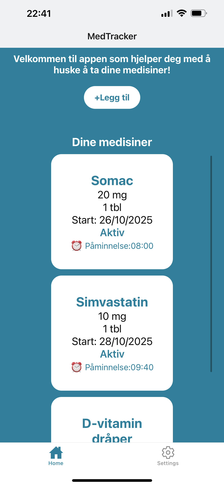
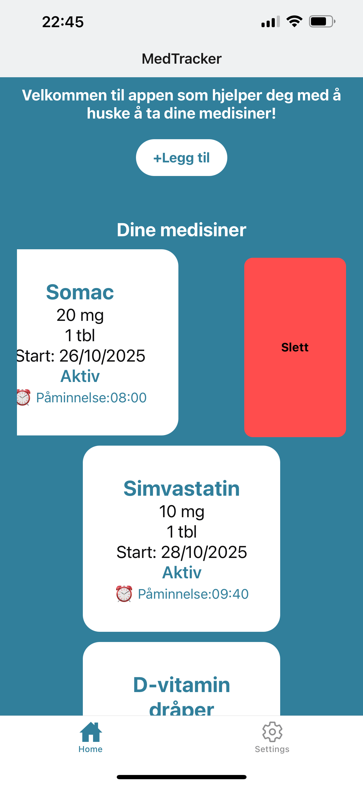
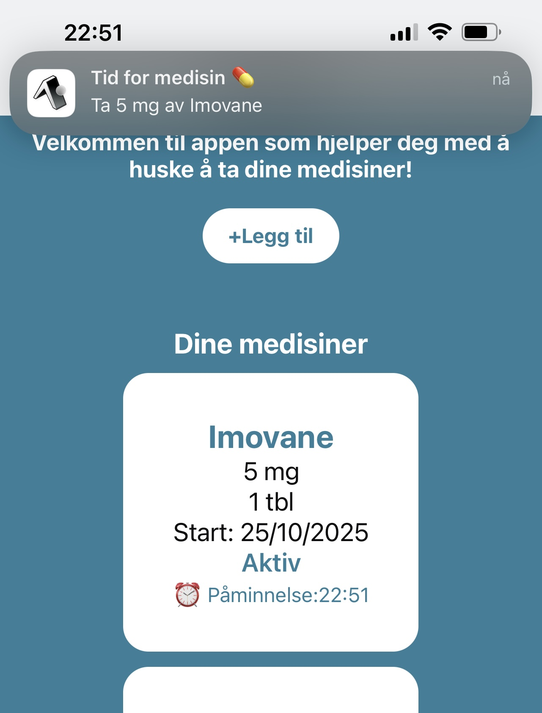

💊 MedTracker
==================================================
MedTracker is a simple and user-friendly app that helps users remember to take their medications on time. It also provides a centralized place to manage all medications, track reminders, and maintain adherence.

🌱 Motivation
==================================================
Medication adherence is a daily challenge, especially for users with multiple prescriptions. As a nurse, I've seen how critical it is to take medications on time to prevent health risks. MedTracker explores how digital tools can support safer, more consistent medication routines. 

⚙️ Tech Stack
==================================================
- React Native (Expo)
- TypeScript 
- JavaScript Object Notation (JSON)
- Local persistence with AsyncStorage

🚀 Features
==================================================
- Add, view, and delete medications
- Daily notification reminders (one reminder per medication)

💡 Future ideas and improvements
==================================================
- Multiple reminders per medication (morning, evening, night)
- Integration with Felleskatalogen API for drug information
- Weekly adherence statistics
- Export medication list as PDF
- Improved user interface

🗺️ Repository Map
==================================================
```
medtracker/
├── src/
│   ├── components/
│   │   ├── AddMedicationForm.tsx
│   │   ├── MedicationItem.tsx
│   │   ├── MedicationList.tsx
│   │   ├── TmcDatePicker.tsx
│   │   ├── TmcDatePicker.types.tsx
│   │   ├── TmcDatePicker.web.tsx
│   ├── utils/
│   │   ├── alert.tsx
│   │   ├── asyncStorage.tsx
│   │   ├── dateUtils.tsx
│   │   ├── timeUtils.tsx
│   ├── app/
│   │   ├── (tabs)/
│   │   │   ├── _layout.tsx        
│   │   │   ├── index.tsx          
│   │   │   ├── settings.tsx       
│   │   ├── add/
│   │   │   ├── index.tsx          
│   │   ├── _layout.tsx
│   │   ├── +not-found.tsx
├── public/
├── app.json
├── package-lock.json
├── package.json
├── tsconfig.json
```

Building and Running the MedTracker app
==================================================

### Start app on mobile & web (Expo Tunnel)
npx expo start --tunnel

### Start web version only
npx expo start --web

📸 Screenshots
==================================================

### Home Screen
Overview of all your medications and daily reminders.


### Add Medication
Add a new medication with dose, frequency, start date, optional end date and, on mobile, a notification reminder.


### Delete medication
Swipe (mobile) or tap (web) to reveal the delete button, then confirm deletion.


### Medication reminder
Example of a notification reminder when it’s time to take a medication.

